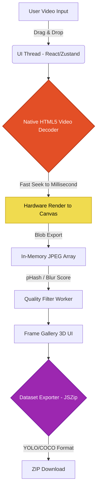

<div align="center">
  
# 🌌 Vedio Frame Cosmos

**The ultimate 100% browser-based, zero-server platform for intelligent video frame extraction and computer vision dataset generation.**

[](https://opensource.org/licenses/MIT)
[](https://reactjs.org/)
[](https://vitejs.dev/)
[](https://tailwindcss.com/)
[](https://threejs.org/)
[](https://developer.mozilla.org/en-US/docs/Web/API/Canvas_API)

[View Live Demo](#) · [Report Bug](#) · [Request Feature](#)

</div>

---

## 📖 Table of Contents

- [Overview](#-overview)
- [Core Capabilities](#-core-capabilities)
- [System Architecture](#-system-architecture)
- [Edge AI & Machine Learning](#-edge-ai--machine-learning)
- [Deployment & Local Development](#-deployment--local-development)
- [Dataset Export Formats](#-dataset-export-formats)
- [Contributing](#-contributing)
- [License](#-license)

---

## 🔭 Overview

**Vedio Frame Cosmos** is a state-of-the-art Web3-era tool designed for ML engineers, computer vision researchers, and data scientists. By leveraging the power of **Native HTML5 Hardware Acceleration**, it processes high-resolution videos entirely on the client-side. Your raw video bytes **never leave your local machine**, guaranteeing absolute data privacy, zero server costs, and blazing-fast unlimited processing bandwidth.

Wrapped in an immersive, highly performant **3D Spatial User Interface** using React Three Fiber, the application provides a cinematic workspace inspired by professional color grading suites. It is fully **Mobile Compatible**, running seamlessly on iOS, Android, and Desktop browsers without downloading heavy WASM payloads.

---

## ⚡ Core Capabilities

- 🔒 **Total Privacy (Zero-Server Architecture)**: Processes everything locally in-browser using the native `<canvas>` API. No API calls, no cloud storage.
- 📱 **100% Mobile & Cross-Browser Compatible**: Bypasses aggressive browser privacy shields and WebAssembly memory limits. Works flawlessly on Brave, iOS Safari, and Chrome Mobile.
- 🌌 **Immersive 3D UI**: A dynamic, glassmorphic spatial workspace built on `react-three-fiber` and Three.js.
- 🧠 **Smart Scene Detection**: Automatically detects distinct scenes using perceptual hashing (pHash) and skips near-duplicate frames.
- 📊 **Real-Time Quality Scoring**: Evaluates and filters extracted frames based on spatial blur variance and histogram contrast entropy.
- 📦 **One-Click Dataset Export**: Zips extracted frames directly into `YOLO v8` and `COCO JSON` folder structures, ready for model training.

---

## 🏗 System Architecture

The architecture relies entirely on the browser's native video hardware decoder and the Canvas API, providing unmatched speed and reliability compared to WebAssembly alternatives.



---

## 🤖 Edge AI & Machine Learning

Vedio Frame Cosmos incorporates intelligent edge heuristics to optimize your ML datasets before you even begin labeling:

1. **Blur Detection**: Calculates the Laplacian variance of grayscale pixels to reject out-of-focus frames.
2. **Perceptual Hashing**: Resizes and converts frames to discrete cosine transform (DCT) hashes to compute Hamming distances, intelligently determining scene boundaries.
3. **TFJS Scaffolding**: Prepared for deep integration with `MobileNetV3` and `EfficientNet` via TensorFlow.js for in-browser visual diversity scoring.

---

## 🚀 Deployment & Local Development

### Prerequisites
- Node.js v18.x or higher
- Git

### Local Setup
```bash
# Clone the repository
git clone https://github.com/abhranilsingharoy-cloud/Vedio-Frame-Cosmos.git

# Navigate into the project directory
cd Vedio-Frame-Cosmos

# Install dependencies
npm install

# Start the Vite development server
npm run dev
```

### Deploying to Vercel
This repository is pre-configured for instant Vercel deployment.
1. Push your code to GitHub.
2. Go to [Vercel](https://vercel.com/) and Import the repository.
3. Click **Deploy**. Vercel handles the rest automatically.

---

## 📁 Dataset Export Formats

Vedio Frame Cosmos allows you to instantly download a ZIP file structured perfectly for popular computer vision training pipelines:

### YOLO v8 Architecture
```text
dataset.zip/
├── dataset.yaml
├── images/
│   └── train/
│       ├── frame_001.jpg
│       └── frame_002.jpg
└── labels/
    └── train/
        ├── frame_001.txt (blank annotation stub)
        └── frame_002.txt
```

### CSV Metadata Example
| frame_id | filename | timestamp_ms | width | height | blur_score | scene_id |
|----------|----------|--------------|-------|--------|------------|----------|
| 1 | frame_001.jpg | 0 | 1920 | 1080 | 0.85 | 1 |
| 2 | frame_002.jpg | 500 | 1920 | 1080 | 0.82 | 1 |

---

## 🤝 Contributing

We welcome contributions from the community! To contribute:
1. Fork the Project
2. Create your Feature Branch (`git checkout -b feature/AmazingFeature`)
3. Commit your Changes (`git commit -m 'Add some AmazingFeature'`)
4. Push to the Branch (`git push origin feature/AmazingFeature`)
5. Open a Pull Request

---

## 📄 License

Distributed under the MIT License. See `LICENSE` for more information.


<div align="center">
  <i>Desigened and Developed by Abhranil Singha Roy.</i>
</div>
